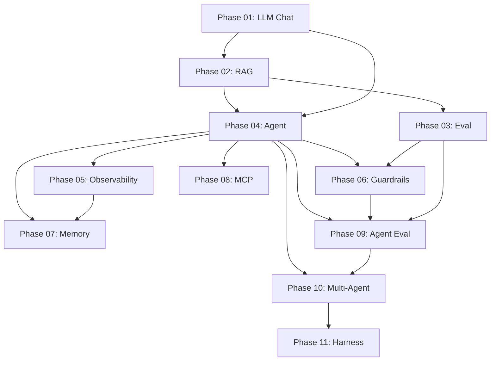

# GenAI Learning Path — Requirements Document

> **Source curriculum:** [The GenAI Learning Path — In Context](https://www.incontext.sh/learning/genai)  
> **Status:** In progress  
> **Last updated:** 2026-06-06

---

## 1. Executive Summary

This project implements the **11-phase, build-as-you-learn GenAI roadmap** from In Context. The goal is not to read about generative AI in the abstract, but to grow **one running Python codebase** from a single LLM API call into a production-minded multi-agent system with RAG, memory, tools, guardrails, evals, and observability.

### Project domain: Stock Research Assistant (Indian equities)

The codebase is built around a single, coherent use case: **given a stock ticker, research the company and produce an investment scorecard**.

The system analyses:
- Promoter holding — current percentage and trend
- Profitability — net margin, ROE, ROCE over 3–5 years
- Revenue growth — YoY percentage, consistency
- Earnings quality — recent quarterly results vs estimates
- Debt levels — debt-to-equity, interest coverage
- News sentiment — recent headlines, red flags

Output: a structured scorecard with a Buy / Hold / Avoid recommendation and score out of 100.

This domain was chosen because:
- All data sources are free and public (NSE/BSE filings, `yfinance`, Screener.in, news RSS)
- The problem is naturally multi-tool and multi-step — a perfect fit for Phases 04–10
- Answer quality is immediately verifiable against known facts
- US stocks can be added later as an extension without changing the architecture

### Artifacts produced phase by phase

- A CLI that queries an LLM about a company (`llm_chat.py`)
- A RAG pipeline over annual reports and earnings transcripts (`rag.py`)
- A regression eval suite for extraction accuracy (`promptfooconfig.yaml`)
- A tool-using research agent (`agent.py`)
- Observability dashboards (`traces.ipynb`)
- Safety guardrails — invalid tickers, stale data, schema validation (`guardrails.py`)
- Cross-session memory of past research runs (`memory.py`)
- An MCP server for financial data lookup (`sql_mcp_server/`)
- Agent-level CI evals (`agent_evals/`)
- A multi-agent system: data fetcher + analyst + report writer (`swarm.py`)
- A harness comparison writeup (`harness.md`)

---

## 2. Guiding Principles (from the curriculum)

These four rules govern every implementation decision:

| Rule | Implication |
|------|-------------|
| **Don't skip ahead** | Phases are sequential. Memory without observability is hard to debug. Multi-agent without eval is chaos. |
| **Ship the artifact** | A phase is not complete until the deliverable runs end-to-end. |
| **Keep one running codebase** | Do not create a new repo per phase. Extend the same project and watch complexity accrete. |
| **Pause to write** | After each phase, write 5 bullets on what surprised you. That reflection is part of the deliverable. |

---

## 3. Prerequisites

### Required

- **Python 3.11+** (3.12 recommended)
- Comfort with the terminal, `pip`, and virtual environments
- Basic Python: functions, type hints, `argparse` or `click`, reading/writing files
- An API account with at least one provider:
  - **Anthropic** (Claude) — recommended for tool-use and MCP alignment
  - **OpenAI** — alternative; also needed for `text-embedding-3-small` in Phase 2 unless Voyage is used
- A `.env` file for API keys (never committed)

### Recommended but not blocking

- Familiarity with Jupyter notebooks (Phase 5)
- Node.js/npm (Phase 3 — Promptfoo is installed globally via npm)
- Docker (optional — for Arize Phoenix in Phase 5)
- SQLite basics (Phase 4 text-to-SQL tool)

### Not required

- Prior LLM or ML experience
- LangChain / LangGraph experience (introduced later, on purpose)
- GPU or local model hosting

---

## 4. Project Architecture

### 4.1 Single-evolving-codebase model

```
Phase 01: llm_chat.py          ← foundation
Phase 02: rag.py               ← imports/calls llm_chat patterns
Phase 03: promptfooconfig.yaml ← tests rag.py pipeline
Phase 04: agent.py             ← wraps rag.py as a tool + adds more tools
Phase 05: traces.ipynb         ← instruments agent.py
Phase 06: guardrails.py        ← hooks around agent.py
Phase 07: memory.py            ← extends agent.py sessions
Phase 08: sql_mcp_server/      ← extracts SQL tool from agent
Phase 09: agent_evals/         ← tests full agent behavior
Phase 10: swarm.py             ← refactors agent into multi-agent
Phase 11: harness.md           ← documents what the harness provides
```

### 4.2 Proposed directory structure (to be created during implementation)

```
genai-learning-path/
├── .env.example              # Template for API keys (no secrets)
├── .gitignore
├── README.md                 # Quick start + phase checklist
├── requirements.txt          # Grows phase by phase
├── docs/
│   ├── REQUIREMENTS.md       # This document
│   ├── PHASE-NOTES/          # Your 5-bullet reflections per phase
│   └── references.md         # Curated links from each phase
├── src/
│   ├── llm_chat.py           # Phase 01
│   ├── rag.py                # Phase 02
│   ├── agent.py              # Phase 04
│   ├── guardrails.py         # Phase 06
│   ├── memory.py             # Phase 07
│   └── swarm.py              # Phase 10
├── evals/
│   ├── promptfooconfig.yaml  # Phase 03
│   └── agent_evals/          # Phase 09
├── mcp/
│   └── sql_mcp_server/       # Phase 08
├── notebooks/
│   └── traces.ipynb          # Phase 05
├── data/
│   ├── corpus/               # Your RAG documents (10–50 docs)
│   └── sample.db             # SQLite for text-to-SQL
└── harness.md                # Phase 11
```

### 4.3 Technology choices (defaults — can be adjusted)

| Layer | Default choice | Alternatives |
|-------|----------------|--------------|
| LLM provider | Google Gemini 2.0 Flash (free) → Anthropic Claude from Phase 03 | OpenAI GPT |
| Embeddings | OpenAI `text-embedding-3-small` | Voyage, Cohere |
| Vector store | FAISS (in-memory) | Chroma, Pinecone |
| PDF parsing | `pdfplumber` / `pypdf` | — |
| Eval (prompt) | Promptfoo | — |
| Observability | Langfuse (cloud) | Arize Phoenix (local) |
| MCP SDK | `mcp` Python package | — |
| Multi-agent | LangGraph or Strands | OpenAI Swarm |
| Guardrails | Hand-rolled + Pydantic | Guardrails AI, NeMo |
| Financial data | `yfinance` (free, no key) | Alpha Vantage, Polygon.io |
| Indian fundamentals | Screener.in (manual export / scrape) | Ticker Tape, Moneycontrol |
| News | NewsAPI free tier / RSS feeds | Google News RSS |

---

## 5. Phase Requirements

Each phase below includes: **goal**, **deliverable**, **acceptance criteria**, **dependencies**, and **estimated effort**.

---

### Phase 01 — FOUNDATIONS: Talk to an LLM

**Goal:** Make your first API call and develop intuition for how LLMs respond.

**Deliverable:** `llm_chat.py` — A CLI that takes a prompt, optional `--model`, `--system`, and `--temperature`, and returns a response.

**What you will learn:**
- LLMs are HTTP APIs: messages in, assistant message out
- System prompt, temperature, and max tokens change behavior dramatically
- Model selection is an engineering tradeoff (speed vs. quality vs. cost)

**Implementation plan:**
1. Sign up for Anthropic or OpenAI; store API key in `.env`
2. Install SDK (`anthropic` or `openai`) + `python-dotenv`
3. Write ~20-line script: read prompt from `sys.argv`, call API, print response
4. Add `--model` flag; compare small vs. frontier model on same prompt
5. Add `--system` and `--temperature` flags; observe output changes
6. Log tokens used, latency, and estimated dollar cost per call

**Acceptance criteria:**
- [ ] `python src/llm_chat.py "What is RAG?"` returns a response
- [ ] Same prompt run on Haiku/mini vs. Sonnet/4o shows measurable quality/latency/cost difference
- [ ] System prompt visibly changes tone and format of output
- [ ] API keys are loaded from `.env`, not hardcoded
- [ ] Module is reusable by later phases (clean function API, not just a script)

**Dependencies:** None (first phase)

**Estimated effort:** 2–4 hours

**Key concepts:** API keys, messages format, model selection, token counting

---

### Phase 02 — RAG: Give the LLM your data

**Goal:** Answer questions over documents the model was never trained on.

**Deliverable:** `rag.py` — Pass a query, get an answer grounded in your docs with citations to retrieved chunks.

**What you will learn:**
- RAG pipeline: chunk → embed → store → retrieve → prompt → answer
- Chunking strategy is the biggest quality lever
- Embeddings as "meaning as vectors"

**Implementation plan:**
1. Pick a personal corpus (10–50 docs): blog posts, notes, PDFs, manuals
2. Convert to plain text; store in `data/corpus/`
3. Start with fixed-size chunks (~500 chars, ~50 overlap)
4. Embed with `text-embedding-3-small`; store in FAISS index
5. Build query function: embed question → top-K search → prompt template → LLM call
6. Iterate chunking: recursive (paragraph → sentence), then semantic; compare on 5 hard questions

**Acceptance criteria:**
- [ ] Answers cite which chunks were retrieved
- [ ] Pipeline answers questions not in model training data (verify with a recent/private doc)
- [ ] At least 3 chunking strategies tested and compared qualitatively
- [ ] `rag.py` exposes a callable function usable as an agent tool in Phase 4
- [ ] FAISS index can be rebuilt from corpus without manual steps

**Dependencies:** Phase 01 (`llm_chat.py` for generation)

**Estimated effort:** 6–10 hours

**Key concepts:** embeddings, vector search, chunking trade-offs, context window

---

### Phase 03 — EVAL: Stop guessing if it works

**Goal:** Measure quality systematically instead of eyeballing outputs.

**Deliverable:** `promptfooconfig.yaml` — A results table showing which model + prompt + chunking combo wins on your data.

**What you will learn:**
- Offline eval as regression testing for LLM apps
- Promptfoo providers, assertions, and comparison UI
- LLM-as-judge for fuzzy quality checks

**Implementation plan:**
1. Install Promptfoo globally: `npm install -g promptfoo`
2. Write 10–20 test cases for Phase 2 RAG (easy + edge cases)
3. Configure 3–4 providers: e.g., Sonnet+naive, Sonnet+recursive, Haiku+recursive
4. Mix assertions: `equals`, `contains`, `llm-rubric`, `javascript`
5. Run `promptfoo eval`; pick winner by pass-rate × cost × latency
6. Document baseline numbers for future regression

**Acceptance criteria:**
- [ ] At least 10 test cases covering factual, ambiguous, multi-doc, and out-of-scope questions
- [ ] At least 3 provider configurations compared side-by-side
- [ ] Web UI shows pass/fail, latency, and cost per cell
- [ ] A "winning" configuration is chosen with written justification
- [ ] Re-running eval after a prompt change detects regressions

**Dependencies:** Phase 02 (`rag.py` pipeline)

**Estimated effort:** 4–8 hours

**Key concepts:** offline eval, regression testing, LLM-as-judge, data-backed selection

---

### Phase 04 — AGENT: Let the LLM use tools

**Goal:** Move from one-shot Q&A to an LLM that decides actions.

**Deliverable:** `agent.py` — A chatbot that routes questions to the right tool: RAG, web search, calculator, or SQL.

**What you will learn:**
- The agent loop: think → act (tool) → observe → repeat
- Tool descriptions are secretly another prompt
- Workflow (you decide steps) vs. agent (LLM decides)

**Implementation plan:**
1. Use raw SDK — no LangChain yet
2. Define 4 tools with clear docstrings and type hints:
   - `search_docs` — wraps Phase 2 RAG
   - `web_search` — Brave or Tavily API
   - `calculator` — safe math evaluation
   - `text_to_sql` — natural language → SQL over `data/sample.db`
3. Implement agent loop with max ~10 iterations
4. Test routing: "What's in my docs?" → RAG; "What's 17% of 842?" → calculator; etc.

**Acceptance criteria:**
- [ ] Agent correctly selects tools for at least 8/10 hand-crafted test questions
- [ ] Loop terminates (no infinite tool-call cycles)
- [ ] RAG and SQL tools return structured results the LLM can use
- [ ] Tool descriptions are documented and intentionally written
- [ ] Agent runs interactively from terminal

**Dependencies:** Phases 01–02; optional web search API key

**Estimated effort:** 8–12 hours

**Key concepts:** function calling, the agent loop, ReAct, tool descriptions

---

### Phase 05 — OBSERVABILITY: See what's happening

**Goal:** Instrument the agent so you can debug and optimize it.

**Deliverable:** `traces.ipynb` — Dashboard showing per-request traces and aggregate metrics (latency, tokens, $).

**What you will learn:**
- Traces as structured timelines of every LLM and tool call
- Aggregate metrics: p95 latency, tokens/request, $/request
- Cost optimization: prompt caching, model routing, context trimming

**Implementation plan:**
1. Choose Langfuse (cloud) or Arize Phoenix (local Docker)
2. Instrument every LLM call: model, prompt, response, tokens, latency, cost
3. Instrument every tool call: name, args, return value, latency
4. Build notebook with aggregate metrics over last N requests
5. Apply optimizations: prompt caching, route easy subtasks to Haiku, trim to top-3 chunks

**Acceptance criteria:**
- [ ] Every agent request produces a visible trace with LLM + tool spans
- [ ] Can answer "why did it answer wrong?" by clicking through a trace in < 2 minutes
- [ ] Aggregate $/request and p95 latency are computed
- [ ] At least one optimization applied with before/after numbers (target: 30–50% cost or latency reduction)

**Dependencies:** Phase 04 (`agent.py`)

**Estimated effort:** 6–10 hours

**Key concepts:** tracing, prompt caching, token economics, model routing

---

### Phase 06 — GUARDRAILS: Keep the agent in its lane

**Goal:** Prevent unsafe, off-topic, or malformed outputs from reaching users.

**Deliverable:** `guardrails.py` — Before/after hooks wrapping the agent: input scope check, output schema/PII guards, groundedness judge.

**What you will learn:**
- Defense in depth: input guard → agent → output guard → groundedness check
- LLM-as-judge for hallucination detection
- PII redaction and schema validation

**Implementation plan:**
1. **Input guard:** fast classifier — "Is this in scope?" → reject early
2. **Output guard:** Pydantic schema validation + PII redaction (emails, phones, SSNs)
3. **Groundedness check:** cheap model judges if answer is supported by retrieved context
4. Wire as pre/post hooks around Phase 4 agent loop
5. Re-run Phase 3 evals + add adversarial cases (jailbreaks, off-topic)

**Acceptance criteria:**
- [ ] Off-scope requests return a friendly rejection (not a hallucinated answer)
- [ ] JSON outputs pass schema validation or are rejected
- [ ] PII is redacted from outputs
- [ ] Groundedness check catches at least one fabricated answer in a test scenario
- [ ] Phase 3 eval pass-rate does not drop below 90% of pre-guardrail baseline

**Dependencies:** Phases 03–04

**Estimated effort:** 6–10 hours

**Key concepts:** defense in depth, LLM-as-judge, prompt injection, PII redaction

---

### Phase 07 — MEMORY: Agents that remember

**Goal:** Move from stateless chat to persistent, personalized interactions.

**Deliverable:** `memory.py` — The agent remembers across sessions, summarizes long chats, and personalizes replies.

**What you will learn:**
- Short-term memory (conversation history in session)
- Long-term memory (user facts across sessions in SQLite)
- Compaction when context window fills up

**Implementation plan:**
1. Short-term: store messages keyed by `session_id`; pass last N turns
2. Long-term: at session end, extract durable facts via LLM; store in SQLite by `user_id`
3. On new session: load facts + recent summary into system prompt
4. Vector store over old conversation summaries for long-term recall
5. Compaction: summarize oldest M turns when session exceeds token budget

**Acceptance criteria:**
- [ ] Agent references a fact from a previous session after restart
- [ ] Long conversations (>20 turns) do not exceed context window (compaction works)
- [ ] User facts are persisted in SQLite and reloadable
- [ ] Memory load is visible in traces (Phase 5) for debugging

**Dependencies:** Phases 04–05

**Estimated effort:** 8–12 hours

**Key concepts:** memory tiers, compaction, user modeling, identity

---

### Phase 08 — MCP: Standardize your tools

**Goal:** Make tools portable across agents and clients.

**Deliverable:** `sql_mcp_server/` — A custom MCP server your agent consumes alongside one community server.

**What you will learn:**
- MCP: tools, resources, prompts as a portable protocol
- Same server works in Claude Desktop, Cursor, and your custom agent
- Community MCP ecosystem

**Implementation plan:**
1. Read MCP spec at [modelcontextprotocol.io](https://modelcontextprotocol.io)
2. Rewrite Phase 4 SQL tool as an MCP server using `mcp` Python SDK
3. Install in Claude Desktop config; verify it works there
4. Connect same server to your Phase 4 agent code
5. Add a community MCP server (filesystem, GitHub, or Brave search)

**Acceptance criteria:**
- [ ] Custom SQL MCP server responds to tool calls from Claude Desktop
- [ ] Same server works from your custom agent without code changes to the server
- [ ] At least one community MCP server integrated
- [ ] Agent can query DB via MCP, not the old inline SQL tool

**Dependencies:** Phase 04 (SQL tool to extract)

**Estimated effort:** 6–10 hours

**Key concepts:** tool portability, MCP ecosystem, capability vs. agent code

---

### Phase 09 — AGENT EVAL: Test the whole loop

**Goal:** Evaluate the agent end-to-end, not just individual prompts.

**Deliverable:** `agent_evals/` — A regression suite that runs in CI and catches behavior drift.

**What you will learn:**
- Trajectory eval: did the agent call the right tools with right args?
- Behavioral assertions: refusal rate, hallucination rate, cost/task
- Golden datasets as long-term moat

**Implementation plan:**
1. Write 10–20 agent test cases: task + expected trajectory + final answer
2. Add behavioral assertions: "must call SQL tool", "must refuse off-scope"
3. Track: trajectory correctness, hallucination rate, refusal rate, $/task, p95 latency
4. Plug into CI (GitHub Actions): fail if pass-rate < 90%
5. Optional: nightly run against larger eval set

**Acceptance criteria:**
- [ ] At least 10 agent test cases with trajectory expectations
- [ ] Eval runner produces pass/fail dashboard
- [ ] CI workflow runs evals on push/PR
- [ ] Deliberately breaking a tool description causes CI failure (proves regression detection)

**Dependencies:** Phases 03–04, 06 (guardrails behavior tests)

**Estimated effort:** 8–12 hours

**Key concepts:** trajectory eval, behavior testing, regression CI, golden datasets

---

### Phase 10 — MULTI-AGENT: From one agent to a team

**Goal:** Decompose hard problems across specialized agents.

**Deliverable:** `swarm.py` — Planner + researcher + SQL agent, coordinated by an orchestrator, with notes on what helped and what didn't.

**What you will learn:**
- Anthropic's 6 patterns: chaining, routing, parallelization, orchestrator-workers, evaluator-optimizer, autonomous
- When multi-agent helps vs. hurts (usually single agent + good tools wins)
- LangGraph, Strands, or Swarm as orchestration frameworks

**Implementation plan:**
1. Read Anthropic's *Building Effective AI Agents*
2. Pick LangGraph or Strands
3. Rebuild Phase 4 agent as orchestrator-workers: planner + RAG + SQL
4. Try swarm pattern (peer handoff, no central coordinator)
5. Compare on same task; document honest assessment

**Acceptance criteria:**
- [ ] At least two orchestration patterns implemented (e.g., orchestrator-workers + swarm)
- [ ] Multi-agent system completes a multi-step task end-to-end
- [ ] Written notes on where multi-agent helped vs. added latency/bugs
- [ ] Phase 9 evals still pass (or regressions are explained)

**Dependencies:** Phases 04, 09

**Estimated effort:** 10–16 hours

**Key concepts:** orchestration, handoffs, the 6 patterns, when multi-agent hurts

---

### Phase 11 — HARNESS: The runtime around the model

**Goal:** Understand what production agent frameworks actually do for you.

**Deliverable:** `harness.md` — Feature comparison + writeup of harnesses used, plus one feature added to your own loop.

**What you will learn:**
- Harness = tool dispatch, retries, streaming, hooks, permissions, session state
- Most production complexity lives outside the model
- Build vs. buy decision for agent infrastructure

**Implementation plan:**
1. Build feature matrix: your loop vs. LangGraph vs. Strands vs. Claude Code
2. Pick one missing feature (streaming or pre/post-tool hooks) and add it
3. Optional: minimal harness with pluggable hooks and permission system
4. Write build-vs-buy recommendation doc

**Acceptance criteria:**
- [ ] Feature comparison matrix covers: tool dispatch, retries, streaming, hooks, permissions, session persistence, observability
- [ ] At least one harness feature added to your hand-rolled loop
- [ ] Document answers: when to use a framework vs. build your own

**Dependencies:** Phases 04–10 (full system to compare)

**Estimated effort:** 4–8 hours

**Key concepts:** the model vs. the system around it, production complexity, build vs. buy

---

## 6. Cross-Cutting Requirements

### 6.1 Security

- API keys only in `.env`; `.env` in `.gitignore`
- Provide `.env.example` with placeholder variable names
- No secrets in logs, traces, or eval outputs
- PII redaction enforced by Phase 06 onward

### 6.2 Cost management

- Log token usage and estimated cost from Phase 01 onward
- Use small/cheap models for guards, judges, and easy subtasks
- Enable prompt caching where supported (Phase 05)
- Set per-request iteration caps on agent loops

### 6.3 Documentation per phase

Each completed phase must add:

1. **Reflection:** 5 bullets in `docs/PHASE-NOTES/phase-NN.md`
2. **Run instructions:** how to execute the deliverable
3. **Dependencies added:** update `requirements.txt`
4. **Checkpoint:** git tag or changelog entry (optional but recommended)

### 6.4 Testing strategy

| Phase | Test type |
|-------|-----------|
| 01–02 | Manual smoke tests |
| 03+ | Promptfoo offline eval (prompt-level) |
| 09+ | Agent trajectory eval in CI |
| 06 | Adversarial guardrail cases |
| All | End-to-end demo script per phase |

---

## 7. Implementation Roadmap

### Suggested timeline

| Weeks | Phases | Cumulative capability |
|-------|--------|----------------------|
| 1 | 01–02 | Chat + RAG over your docs |
| 2 | 03–04 | Evaluated, tool-using agent |
| 3 | 05–06 | Observable, guarded agent |
| 4 | 07–08 | Persistent memory + portable MCP tools |
| 5 | 09–10 | CI-tested multi-agent system |
| 6 | 11 | Production harness understanding |

**Total estimated effort:** 70–120 hours (part-time over 6–10 weeks is realistic)

### Phase dependency graph



---

## 8. Post-Path: What Comes After the 11 Phases

The curriculum defines three next steps (not in scope for initial implementation):

### NOW — Build your own thing
- Personal assistant over notes/calendar/email
- Tool for someone you know (small business, hobby, family)
- Clone-with-a-twist of a daily-use app

### WEEKLY — Stay in the loop
- Anthropic Engineering blog
- Simon Willison's blog
- Latent Space podcast
- AI Snake Oil
- One community (Anthropic Discord, MCP Discord, r/LocalLLaMA)

### LATER — Go deeper (pick ONE)
- Fine-tuning
- Advanced RAG (reranking, hybrid search, multi-hop)
- Voice & vision agents
- Code agents
- Browser & computer-use agents
- Alignment & safety

---

## 9. Open Decisions (resolve before Phase 01 implementation)

| Decision | Options | Recommendation |
|----------|---------|----------------|
| Primary LLM provider | Anthropic / OpenAI | Anthropic (better tool-use docs, MCP origin) |
| Embedding provider | OpenAI / Voyage | OpenAI `text-embedding-3-small` (simplest) |
| Observability backend | Langfuse / Phoenix | Langfuse for simplicity; Phoenix if you want local-only |
| Multi-agent framework | LangGraph / Strands / Swarm | LangGraph (most flexible, widely documented) |
| Personal RAG corpus | Your notes / work docs / public PDFs | Pick something you care about — motivation matters |
| Web search API | Brave / Tavily | Tavily (built for agents) |

---

## 10. Success Criteria (project complete)

The project is **complete** when:

- [ ] All 11 deliverable files/directories exist and run end-to-end
- [ ] Phase 3 eval suite has a documented baseline and still passes
- [ ] Phase 9 agent evals run in CI with ≥ 90% pass-rate
- [ ] Observability shows real $/request and p95 latency numbers
- [ ] Guardrails block adversarial inputs without breaking legitimate queries
- [ ] MCP SQL server works in both Claude Desktop and custom agent
- [ ] Multi-agent prototype has honest written assessment of tradeoffs
- [ ] `harness.md` documents build-vs-buy with feature matrix
- [ ] 11 reflection documents exist in `docs/PHASE-NOTES/`

---

## 11. Phase Workflow

Each phase follows the same pattern:

1. Review requirements for that phase only
2. Scaffold — add only the files and dependencies needed
3. Implement the deliverable
4. Run the acceptance criteria checklist
5. Write 5 reflection bullets in `docs/PHASE-NOTES/phase-NN.md`
6. Commit before moving to the next phase

Phases are sequential. Do not batch them.

---

## 12. References

- [The GenAI Learning Path — In Context](https://www.incontext.sh/learning/genai)
- [Anthropic Tool Use Guide](https://docs.anthropic.com/en/docs/build-with-claude/tool-use)
- [Model Context Protocol](https://modelcontextprotocol.io)
- [Promptfoo Documentation](https://www.promptfoo.dev/docs/intro/)
- [Anthropic — Building Effective AI Agents](https://www.anthropic.com/research/building-effective-agents)
- [Langfuse Docs](https://langfuse.com/docs)
- [LangGraph Docs](https://langchain-ai.github.io/langgraph/)

---

*This document is the single source of truth for project scope.*
